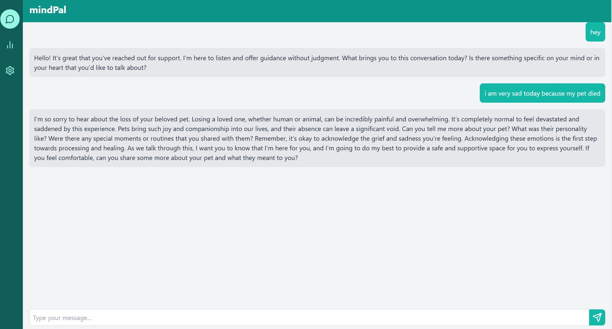
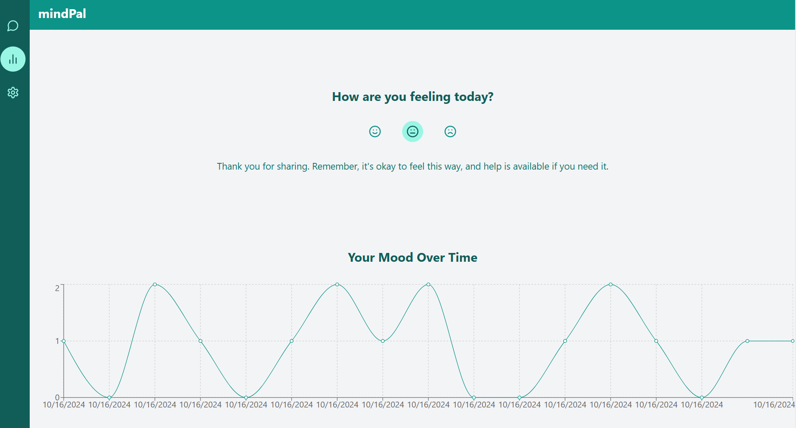

# mediPal 🌱

Welcome to **mediPal**, your friendly mental health chatbot! The mission is to provide you with a supportive and empathetic companion as you navigate your mental well-being journey. With backend built on **FastAPI** and a sleek frontend developed in **React**, mediPal is here to listen, understand, and guide you.

## What is mediPal?

**mediPal** is more than just a chatbot; it’s a companion designed to engage in meaningful conversations and provide emotional support. Powered by the **LLaMA3 7B parameter model**, mediPal generates thoughtful responses, helping you feel heard and understood. 

## Key Features

- **Interactive Chat Experience**: Enjoy real-time conversations that feel natural and supportive.
- **AI-Powered Responses**: Our smart AI understands context and delivers emotionally attuned replies.
- **Secure and Efficient**: The FastAPI backend ensures your interactions are handled securely and swiftly.
- **User-Friendly Design**: The React frontend offers a seamless and responsive interface across all devices.

## Technologies Used

- **Backend**: **FastAPI**
  - Handles requests and manages conversations with the LLaMA3 model.
  - Efficiently processes user interactions to provide timely responses.

- **Frontend**: **React**
  - A modern, responsive interface that enhances your chat experience.
  - Dynamically updates to reflect your conversations with mediPal.

- **AI Model**: **LLaMA3 7B**
  - This model generates human-like responses, understanding your context and needs.

## 📷 Screenshots

Here are some screenshots of mediPal in action:

    
    

